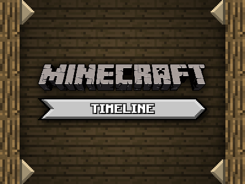
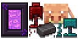

# [Minecraft Timeline](https://minecraft-timeline.github.io/)
Repository of the Minecraft Timeline project, listing every update to the game in one timeline for each edition.



This began as a simple static image [posted on Reddit](https://www.reddit.com/r/Minecraft/comments/akco1t/seeing_as_a_lot_of_redditors_are_coming_back_to/) that gained a lot of traction (even appearing briefly in some videos [[1]](https://www.youtube.com/watch?v=3m5BAIA2-4Q?t=35) [[2]](https://youtu.be/tTLhWEXxtx4?t=174)); enough to motivate me to create this simple, interactable timeline easily available to all.

You are welcome to contribute by fixing bugs, but mainly, by adding missing versions of the game to `version_data.json` :)

## version_data.json

The versions file follows a simple structure. It's divided in `editions` which contain `versions` and `upcomings`. Both are lists of the same type (Version) that have the following fields:

- `type`: Either `major` (major updates, appears big on the timeline), `minor` (minor updates, appears small on the timeline), `event` (for important events to the history of the edition, appears as an exclamation mark on the timeline) or `memory` (for famous nostalgic moments, appears as a heart on the timeline). **Required.**
- `date`: The date of the version, in the format yyyy-MM-dd[T[hh][:mm][:ss]]. **Required for `versions`**.
- `possibleDate`: A possible date of the version, in no particular format. Optional, but only appears in `upcomings`.
- `title`: The big display title of the version (e.g. **"Update Aquatic"**). Optional.
- `subtitle`: The smaller subtitle of the version (e.g. *"1.13"*). Optional.
- `description`: The short description of the version (e.g. "Ocean Overhaul & Phantoms"). Optional.
- `longDescription`: A very long description of the version. Optional, but use very sparingly (pretty much just for big `event`s).
- `funFact`: A light hearted medium description of the version, meant for not widely known "fun facts" or "did you know?" lines. Optional.
- `icon`: Path to an image icon of the version, relative to `images/icons/timeline`. Optional.
- `learnMore`: URL for more information of the version. You can also use the syntax `#NAME` as a shorthand to `minecraft.fandom.com/wiki/NAME`. Optional.
- `video`: A YouTube video ID (the string after ?w= in a YT URL). Displays a video frame on the info panel, and if there is no `icon` will add a Youtube icon to the timeline. Optional.
- `mainFeatures`: A list of Feature objects, which only contain a `text` field (others may be added in the future). Contains the most important features of an update.
- `minorFeatures`: The same as `mainFeatures` but for less important yet noteworthy features.

## Icons

Timeline icons are located in `images/icons/timeline`, but *update* icons (unique for each major update) are in the subfolder `versions/<edition>/version_<version>.png`.

  

All timeline icons must have 64px of height and at most 128px of width. They should all follow the same art style, following these guidelines:

- Include as few elements as needed to properly represent the update, but no fewer.
- Blocks should always be 3D.
- Pixel art must have a constant, integer pixel size.
- Structures should have its own custom pixel art.
- Mobs should only be depicted as a head, unless more is needed.
- All items in a same icon must have the same pixel size.
- There must be a drop shadow of 2px vertical offset and 50% opacity.

## Thank you

Thanks to everyone who shared, enjoyed and contributed to this small project. Over the years, I have received many kind messages of people thanking me for creating Minecraft Timeline, and if it wasn't for your support, I wouldn't be still mantaining this. So, thank you, and let's enjoy many Minecraft updates to come!

\- Henry

---

```
"Minecraft" is a trademark of Mojang Studios.
This project is not affiliated with Mojang, or Microsoft.
```
